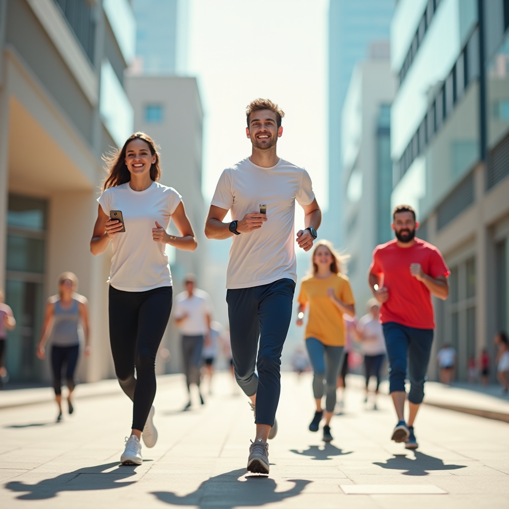

# Testing AI Company

### Product Spec (CEO, Product Managers, developers, Users)

prompt:
```md
User requested an app for tracking daily steps, providing workout plans, and integrating with health trackers.
```

View file [Product Summary](./product_summary.md)

### Ad Script (Producers, Users)

prompt:
```md
Create a 30-second TV commercial for an app for tracking daily steps, providing workout plans, and integrating with health trackers.
```

Output: View file [Ad Script](./ad_script.md)

### Image Gen / Marketing (Prompt Engineers)

##### prompt
```md
fitness app that tracks daily steps, provides workout plans, and integrates with health trackers. The ad should target adults aged 25-45, specifically busy professionals and parents, who need help achieving their health and fitness goals. The message should emphasize that the app celebrates small victories and empowers users to live healthier lives.
```

##### Output Prompt:
```md
A single model, radiating confidence and joy, is standing in a whimsical organic cityscape built entirely from repurposed natural materials like bamboo, wood, and stone. The buildings have a fluid, organic design, blending seamlessly with the surrounding gardens and greenery. The model is playfully interacting with a whimsical, nature-inspired installation made from recycled materials, perhaps climbing a vine-covered structure or lounging on a natural platform overlooking a garden. The clothing is airy and flowing, made from natural materials like linen or organic cotton. The designs incorporate nature-inspired elements like intricate floral patterns, subtle leaf motifs, or textures mimicking wood or bark. The fabric flows gracefully, showcasing the texture and craftsmanship. The colors are a nuanced blend of earthy tones like terracotta, deep greens, and warm yellows, accented with pops of vibrant coral and turquoise. The lighting is soft and natural, with dappled sunlight filtering through the foliage, creating a warm, inviting glow. The art style is photorealistic, with a slightly dreamy, ethereal quality. Minimal text, emphasizing the brand name and a tagline like 'Sustainable Style, Rooted in Nature,' is visible in a simple and elegant font. The overall image evokes a sense of playful innovation, sustainable fashion, and a vibrant, summery spirit.
```

##### Image generated:

